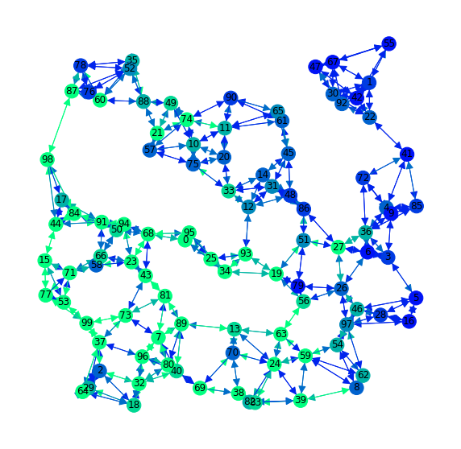

# traffic_graphnn_toy
A toy model of the traffic graph NN.  
The purpose of this model is to see if the proposed NN architecture in `graphnn` and `graphnn_local` repos works with a controlled system.  
That is, with clean data that follows a well-behaved pattern, can the NN learn the model? Turns out it decisively can.
The notebook `toy_traffic.ipynb` tells the whole story, but basically a limited number of cars are generated and they all "want" to precess in a clockwise fashion. There is also Gaussian randomness and variability injected to their movement.  
The graph NN is an Interaction network where edges and nodes are updated using edge, node, and global values.

